# 1. Complete Repository Architecture

```mermaid
flowchart TD
Root["desktop/"]
Root --> Brain["brain/"]
Brain --> Intelligence["intelligence/"]
Brain --> Reasoning["reasoning/"]
Brain --> Decision["decision/"]
Brain --> Planning["planning/"]
Brain --> Execution["execution/"]
Brain --> Memory["memory/"]
Brain --> Graph["graph/"]
Brain --> Consolidation["consolidation/"]

Root --> Bootstrap["bootstrap/"]
Bootstrap --> Config["config.py"]
Bootstrap --> Container["container.py"]
Bootstrap --> Lifecycle["lifecycle.py"]
Bootstrap --> Manager["manager.py"]

Root --> Orchestrator["orchestrator/"]
Orchestrator --> CognitivePipeline["cognitive_pipeline.py"]
Orchestrator --> Feedback["feedback.py"]

Root --> Observability["observability/"]
Observability --> ObsManager["manager.py"]
Observability --> Logger["logger.py"]
Observability --> Metrics["metrics.py"]
Observability --> Tracer["tracer.py"]
Observability --> Diagnostics["diagnostics.py"]

Root --> Updater["updater/"]
Updater --> UpdManager["manager.py"]
Updater --> Rollback["rollback.py"]
Updater --> InstallHooks["installer_hooks.py"]

DeployRoot["deploy/"]
DeployRoot --> Spec["chitti_v2.spec"]
DeployRoot --> Iss["installer.iss"]
DeployRoot --> Assets["assets/"]

Main["main.py"]
```

# 2. Repository Ownership

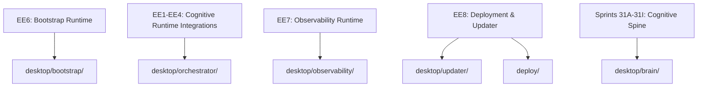

# 3. Startup Flow

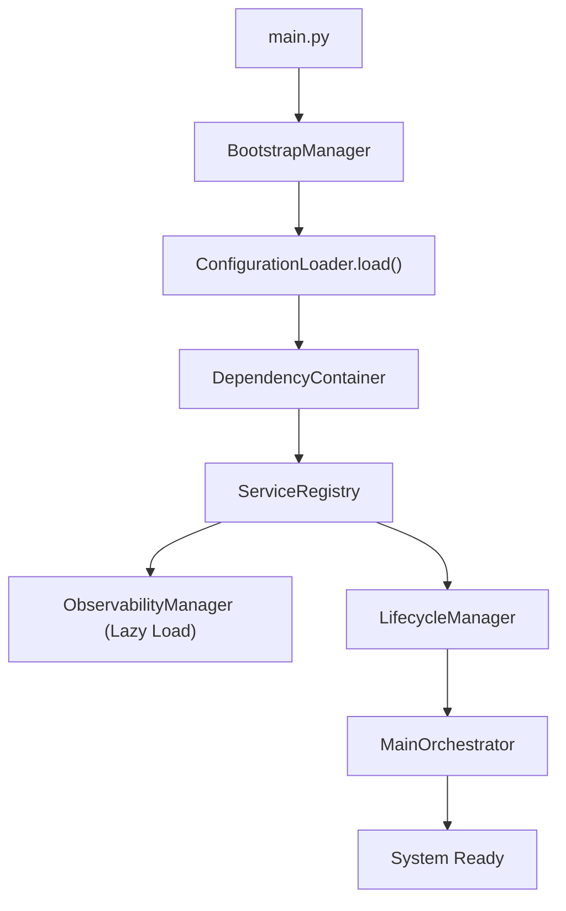

# 4. Dependency Injection Graph

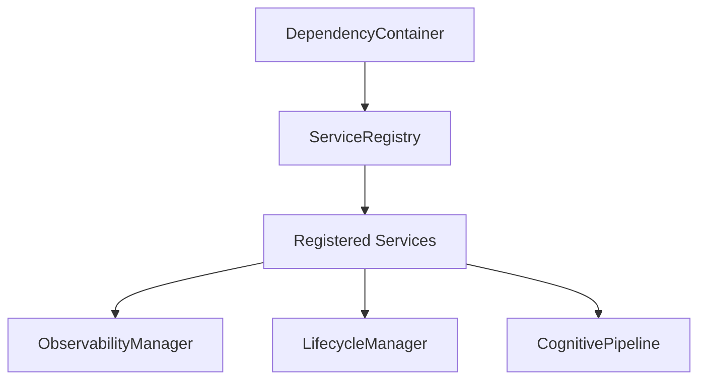

# 5. Runtime Service Graph

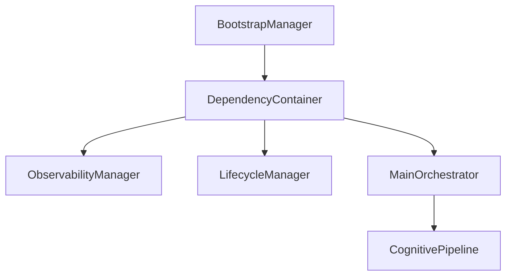

# 6. Audio Pipeline

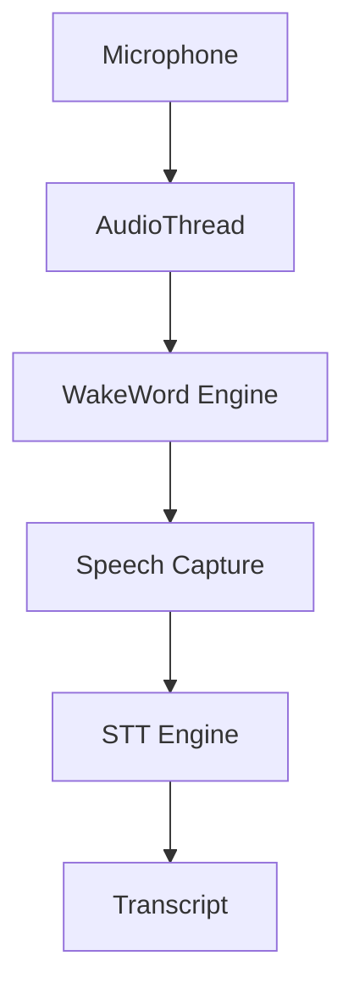

# 7. Wakeword Pipeline

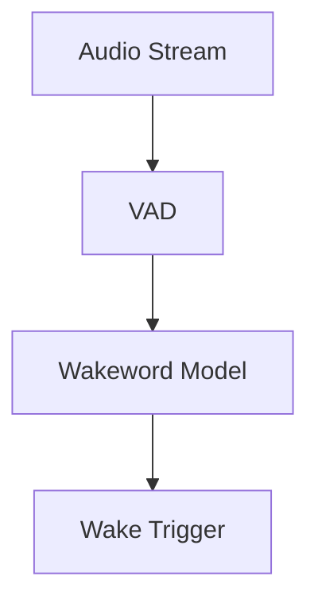

# 8. STT Pipeline

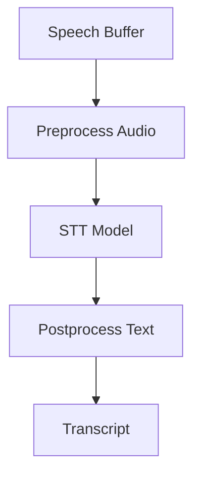

# 9. Conversation Pipeline

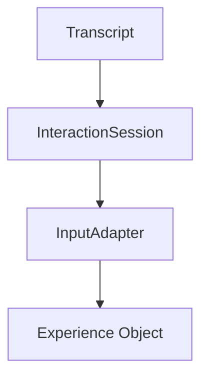

# 10. Cognitive Pipeline

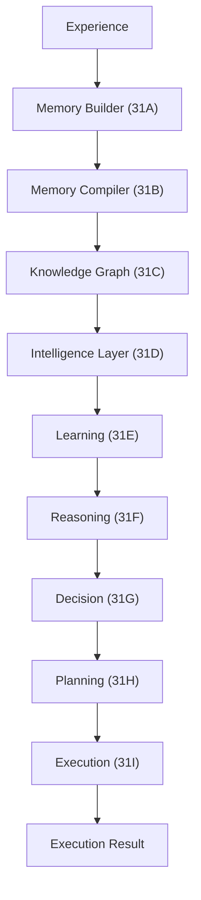

# 11. Memory Architecture

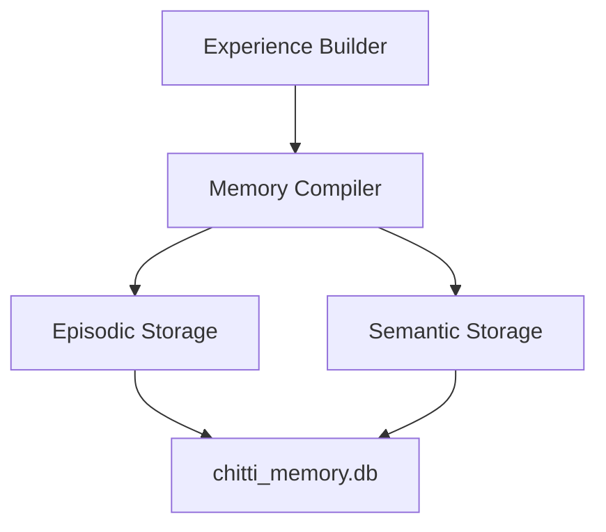

# 12. Knowledge Graph

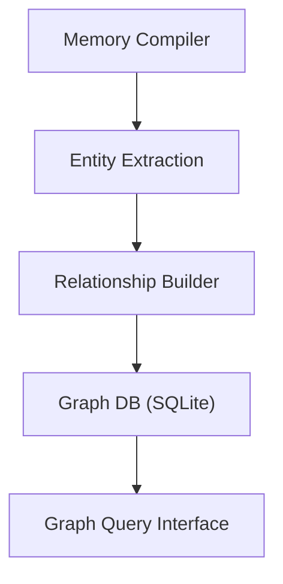

# 13. Intelligence Layer

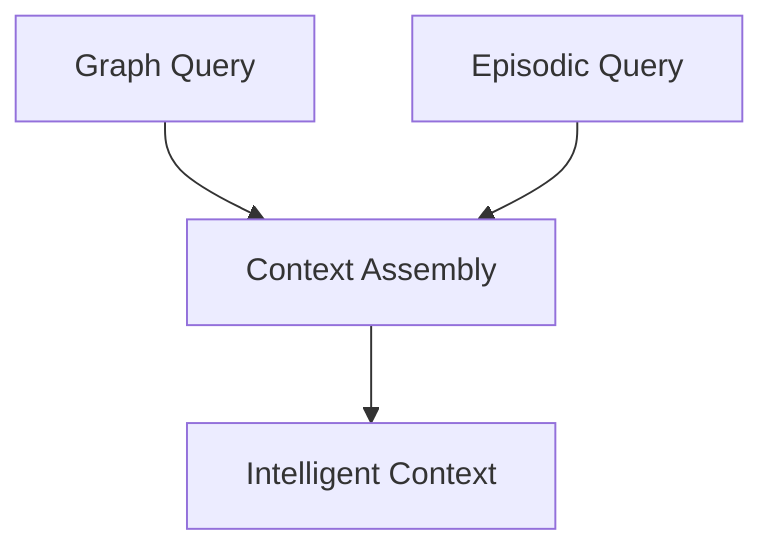

# 14. Reasoning Layer

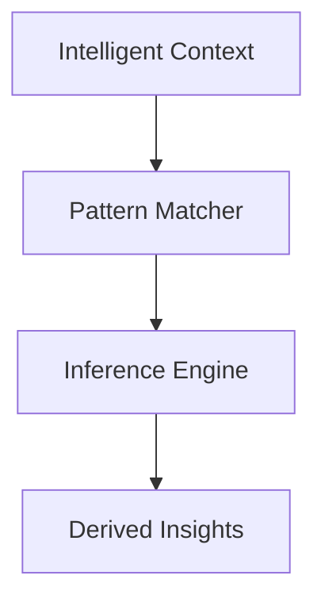

# 15. Decision Layer

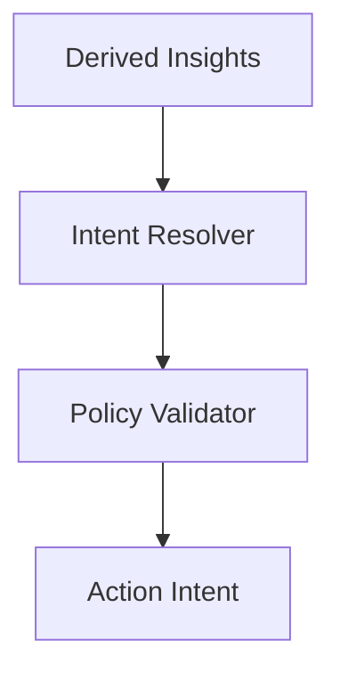

# 16. Planning Layer

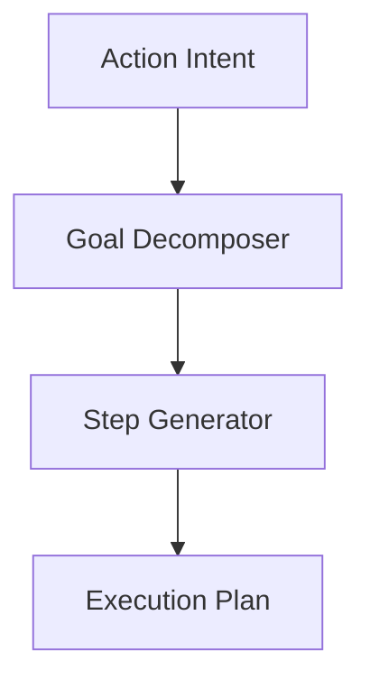

# 17. Execution Layer

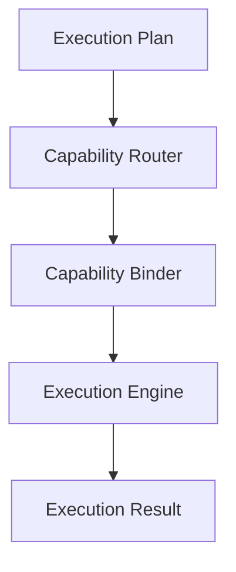

# 18. Capability Platform

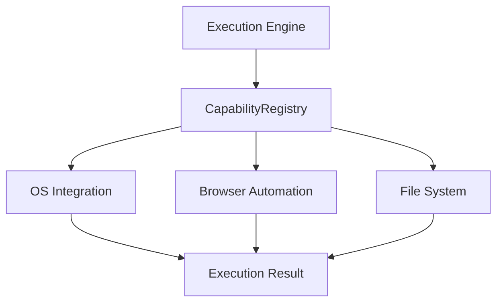

# 19. Vision Pipeline

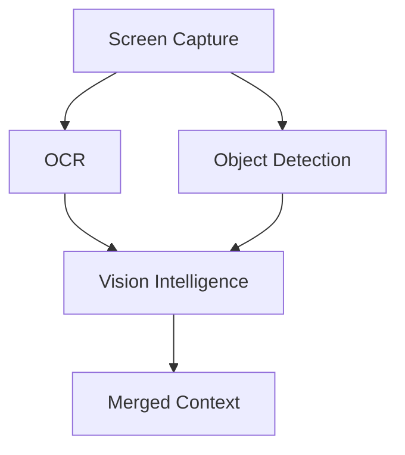

# 20. Character Layer

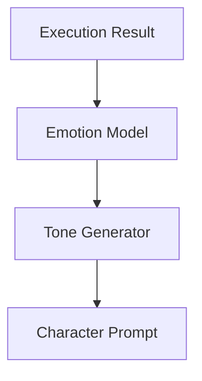

# 21. LLM Pipeline

```mermaid
flowchart TD
CharacterPrompt["Character Prompt"] --> LLMModel["LLM Engine"]
LLMModel --> TextStream["Text Stream"]
```

# 22. Response Generation

```mermaid
flowchart TD
TextStream["Text Stream"] --> PostProcessor["Post Processor"]
PostProcessor --> FinalResponse["Final Response"]
```

# 23. TTS Pipeline

```mermaid
flowchart TD
FinalResponse["Final Response"] --> TTSEngine["TTS Engine"]
TTSEngine --> AudioRenderer["Audio Renderer"]
AudioRenderer --> Speaker["Speaker"]
```

# 24. UI Pipeline

```mermaid
flowchart TD
FinalResponse["Final Response"] --> DesktopUI["Desktop UI"]
DesktopUI --> Overlay["Screen Overlay"]
DesktopUI --> Widget["Widgets"]
```

# 25. Continuous Learning

```mermaid
flowchart TD
ExecutionResult["ExecutionResult"] --> FeedbackCollector["FeedbackCollector"]
FeedbackCollector --> ExperienceBuilder["ExperienceBuilder"]
ExperienceBuilder --> ConsolidationEngine["ConsolidationEngine"]
ConsolidationEngine --> SQLite["SQLite Memory"]
```

# 26. Observability

```mermaid
flowchart TD
Runtime["Any Runtime Component"] --> ObsManager["ObservabilityManager"]
ObsManager --> WorkerThread["TelemetryWorkerThread"]
WorkerThread --> StructuredLogger["StructuredLogger"]
WorkerThread --> MetricsRegistry["MetricsRegistry"]
WorkerThread --> ExecutionTracer["ExecutionTracer"]
StructuredLogger --> Diagnostics["DiagnosticSnapshotGenerator"]
```

# 27. Bootstrap

```mermaid
flowchart TD
ConfigLoader["ConfigurationLoader"] --> DepContainer["DependencyContainer"]
DepContainer --> LifecycleManager["LifecycleManager"]
LifecycleManager --> BootPhase1["Phase 1 Init"]
LifecycleManager --> BootPhase2["Phase 2 Init"]
LifecycleManager --> Running["Running State"]
```

# 28. Deployment

```mermaid
flowchart TD
Installer["Installer (.exe)"] --> InstallHooks["InstallationManager"]
InstallHooks --> AssetManifest["AssetManifest Validation"]
AssetManifest --> ConfigProvision["Configuration Provisioning"]
ConfigProvision --> Runtime["Runtime"]
UpdateManager["UpdateManager"] --> UpdateManifest["UpdateManifest"]
UpdateManifest --> Staging["Staging Payload"]
Staging --> Rollback["RollbackManager"]
Rollback --> Runtime
```

# 29. Thread Architecture

```mermaid
flowchart TD
MainThread["Main Thread (Lifecycle, Config, UI)"]
AudioThread["Audio Thread (Mic, Wakeword)"]
TelemetryThread["TelemetryWorkerThread (Queue Consumer)"]
UpdateThread["UpdateManager Polling Thread"]
ExecutionThread["Cognitive Pipeline Thread (Async)"]

MainThread --> AudioThread
MainThread --> TelemetryThread
MainThread --> UpdateThread
MainThread --> ExecutionThread
```

# 30. Database Architecture

```mermaid
flowchart TD
SQLite["SQLite Engine"]
SQLite --> MemoryDB["chitti_memory.db"]
MemoryDB --> EpisodicTables["Episodic Tables"]
MemoryDB --> SemanticTables["Semantic Tables"]
MemoryDB --> GraphTables["Graph Tables"]
```

# 31. End-to-End Request Flow

```mermaid
flowchart TD
UserSpeak["User Speaks"] --> STT["STT"]
STT --> Transcript["Transcript"]
Transcript --> CognitivePipeline["CognitivePipeline (31A-31I)"]
CognitivePipeline --> ExecutionResult["ExecutionResult"]
```

# 32. End-to-End Response Flow

```mermaid
flowchart TD
ExecutionResult["ExecutionResult"] --> CharacterLayer["Character Layer"]
CharacterLayer --> LLM["LLM"]
LLM --> TTS["TTS"]
TTS --> AudioRenderer["Audio Renderer"]
AudioRenderer --> UserHear["User Hears Response"]
```

# 33. Complete CHITTI V2 Master Architecture

```mermaid
flowchart TD
    User["User"] --> Microphone["Microphone"]
    Microphone --> AudioPipeline["Audio Pipeline"]
    AudioPipeline --> Transcript["Transcript"]
    
    Transcript --> InputAdapter["InputAdapter"]
    InputAdapter --> ExperienceObj["Experience Object"]
    
    ExperienceObj --> S31A["Memory Builder (31A)"]
    S31A --> S31B["Memory Compiler (31B)"]
    S31B --> S31C["Knowledge Graph (31C)"]
    S31C --> S31D["Intelligence Layer (31D)"]
    S31D --> S31E["Learning (31E)"]
    S31E --> S31F["Reasoning (31F)"]
    S31F --> S31G["Decision (31G)"]
    S31G --> S31H["Planning (31H)"]
    S31H --> S31I["Execution (31I)"]
    
    S31I --> CapabilityRegistry["CapabilityRegistry"]
    CapabilityRegistry --> ExecResult["ExecutionResult"]
    
    ExecResult --> FeedbackCollector["FeedbackCollector"]
    FeedbackCollector --> S31A
    
    ExecResult --> CharacterLayer["Character Layer"]
    CharacterLayer --> LLM["LLM"]
    LLM --> TTS["TTS"]
    TTS --> User
    
    BootstrapManager["BootstrapManager"] --> MainOrchestrator["MainOrchestrator"]
    MainOrchestrator --> ExperienceObj
    
    ObservabilityManager["ObservabilityManager"] --> TelemetryWorkerThread["TelemetryWorkerThread"]
    TelemetryWorkerThread --> StructuredLogger["StructuredLogger"]
    TelemetryWorkerThread --> MetricsRegistry["MetricsRegistry"]
    TelemetryWorkerThread --> ExecutionTracer["ExecutionTracer"]
    
    InstallationManager["InstallationManager"] --> AssetManifest["AssetManifest"]
    AssetManifest --> ConfigurationLoader["ConfigurationLoader"]
    ConfigurationLoader --> BootstrapManager
    
    UpdateManager["UpdateManager"] --> UpdateManifest["UpdateManifest"]
    UpdateManifest --> RollbackManager["RollbackManager"]
    RollbackManager --> ConfigurationLoader
    
    S31A --> MemoryDB["chitti_memory.db"]
    S31C --> MemoryDB
```
