# CHITTI V2 — MASTER ARCHITECTURE & ENGINEERING SPECIFICATION
**(Canonical Architectural Reference & Data Flow Manual)**

======================================================================
## 1. EXECUTIVE ENGINEERING OVERVIEW
======================================================================

CHITTI V2 is a deterministic, event-driven, multi-runtime desktop companion platform. It operates on a strict 4-layer cognitive architecture (Context -> Planning -> Execution -> Evaluation) bound to isolated visual, auditory, and cognitive runtimes.

### Core Architectural Invariants:
1. **DecisionEngine Purity (Rule 18):** Given the same `PlanningContext`, `DecisionEngine` strictly returns the exact same `Decision`. No event bus, no network, no logging, no async, no side effects.
2. **Platform Layering Isolation (Rule 24):** No runtime may invoke another runtime's public implementation directly. Orchestration occurs exclusively through published contracts, events, and the Runtime Kernel.
3. **Execution Decoupling:** Runtimes emit declarative execution outcomes; they never dictate subsequent planning actions.
4. **Memory Hierarchy (Rule 176):** Observations are transient $\rightarrow$ Episodes are durable $\rightarrow$ Knowledge is permanent. Memory reads are unconstrained; writes occur exclusively via explicit memory workflows (`PersistEpisode`).
5. **Visual Coordination Purity:** The `VisualCoordinator` synchronizes timing and priorities across visual runtimes without performing rendering, window creation, capability execution, or asset ownership.

---

======================================================================
## 2. LAYERED SYSTEM ARCHITECTURE
======================================================================

```
+--------------------------------------------------------------------+
| Layer 7: User Experience & Desktop Companion                        |
|   - Character Presence (Floating Slime / System Tray / Docked)     |
|   - Desktop UI Windows (Transparent Overlays, Notifications)       |
|   - Desktop Widgets (17 Generic Session-Bound Widgets)             |
+--------------------------------------------------------------------+
                                  |
+--------------------------------------------------------------------+
| Layer 6: Visual & Expression Orchestration                        |
|   - Visual Coordinator Platform (Unified Timeline, Priority Engine)|
|   - Expression Runtime (Renderer Bridge & Expression Switching)     |
|   - Motion Design System (Spring Tokens, Slime Deformation)        |
+--------------------------------------------------------------------+
                                  |
+--------------------------------------------------------------------+
| Layer 5: Conversation & Voice Platform                            |
|   - Speech Runtime (STT Engine, VAD, Wake Word Engine)            |
|   - TTS Runtime (Audio Synthesis, Speech Timelines, Lipsync)       |
|   - Personality Engine & Character Identity Platform               |
+--------------------------------------------------------------------+
                                  |
+--------------------------------------------------------------------+
| Layer 4: Cognitive & Planning Engine                               |
|   - Planner Runtime (Deterministic Task Graphs)                    |
|   - Workflow Runtime (Immutable State Machines)                    |
|   - DecisionEngine & Reasoning Policy Engine                       |
+--------------------------------------------------------------------+
                                  |
+--------------------------------------------------------------------+
| Layer 3: Capability & Execution Engine                             |
|   - Capability Runtime (Stateful & Stateless Capabilities)         |
|   - Execution Spine (ExecutionPlan, ExecutionDelta)                |
|   - Verification Runtime (Post-Execution Assertion Engine)         |
+--------------------------------------------------------------------+
                                  |
+--------------------------------------------------------------------+
| Layer 2: Cognitive Memory & Observation Platform                   |
|   - Semantic Memory & Knowledge Graph Runtime                      |
|   - Episodic Memory Runtime (SQLite chitti_memory.db)              |
|   - Activity Intelligence Runtime & Observation Engine             |
+--------------------------------------------------------------------+
                                  |
+--------------------------------------------------------------------+
| Layer 1: Runtime Kernel & Operating System Bridge                  |
|   - BootManager & Runtime Kernel (Lifecycle State Machine)         |
|   - Deterministic EventBus                                         |
|   - OS Integration Adapters (Windows API, Process, Display, Audio) |
+--------------------------------------------------------------------+
```

---

======================================================================
## 3. SUBSYSTEM & RUNTIME SPECIFICATIONS
======================================================================

### 3.1 Runtime Kernel & BootManager
- **Purpose:** Manages system startup, readiness barriers, runtime registration, event bus routing, and orderly shutdown.
- **Responsibilities:** Instantiates subsystem runtimes, enforces initialization barriers, publishes lifecycle events (`KernelBootStarted`, `KernelBootComplete`, `KernelShutdownStarted`).
- **Inputs:** `RuntimeConfiguration`.
- **Outputs:** Ready `RuntimeKernel` facade.
- **Dependencies:** None.
- **Consumed Events:** None.
- **Published Events:** `KernelBootStarted`, `KernelBootComplete`, `KernelShutdownStarted`.
- **Ownership:** Kernel Thread.
- **Failure Recovery:** Rolls back runtime initialization and emits `KernelBootFailed`.

### 3.2 Planner Runtime & DecisionEngine
- **Purpose:** Translates user intent and context into deterministic execution plans.
- **Responsibilities:** Evaluates `PlanningContext`, selects task workflows, enforces Rule 18 (Pure Decision Engine).
- **Inputs:** `UserIntent`, `PlanningContext`, `ConversationState`.
- **Outputs:** `ExecutionPlan`.
- **Dependencies:** `RuntimeKernel`, `MemoryAPI`.
- **Consumed Events:** `IntentParsed`, `UserRequestReceived`.
- **Published Events:** `PlannerStarted`, `PlannerFinished`, `PlannerFailed`.
- **Ownership:** Main Worker Thread.
- **Failure Recovery:** Yields to fallback execution workflow or requests user clarification.

### 3.3 Workflow Runtime & Execution Spine
- **Purpose:** Executes immutable workflow state machines step-by-step.
- **Responsibilities:** Enforces atomic workflow steps, tracks `ExecutionPlan` progression, emits `ExecutionDelta`.
- **Inputs:** `ExecutionPlan`.
- **Outputs:** `ExecutionResult`, `ExecutionDelta`.
- **Dependencies:** `CapabilityRegistry`, `EventBus`.
- **Consumed Events:** `WorkflowStarted`, `WorkflowStepExecuted`.
- **Published Events:** `WorkflowCompleted`, `WorkflowFailed`, `WorkflowStepFailed`.
- **Ownership:** Execution Thread.
- **Failure Recovery:** Replays workflow from checkpoint or halts atomically.

### 3.4 Verification Runtime
- **Purpose:** Evaluates post-execution observations against expected capability contracts.
- **Responsibilities:** Inspects desktop observation snapshots (process, window, filesystem, visual bounding box), verifies execution assertions.
- **Inputs:** `ExecutionResult`, `PageSnapshot` / `VisionLayoutTree`.
- **Outputs:** `VerificationOutcome`.
- **Dependencies:** Desktop Observation Engine.
- **Consumed Events:** `ExecutionCompleted`.
- **Published Events:** `VerificationPassed`, `VerificationFailed`.
- **Ownership:** Verification Worker.
- **Failure Recovery:** Triggers workflow retry or flags failure to planner.

### 3.5 Capability Platform
- **Purpose:** Provides modular feature capability implementations (Time, Distance, Navigation, Browser, Vision, Search, File, Desktop, Email).
- **Responsibilities:** Executes isolated capability contracts, returns `CanonicalCapabilityOutput`.
- **Inputs:** `CapabilityRequest`.
- **Outputs:** `CanonicalCapabilityOutput`.
- **Dependencies:** Environment Adapters (Playwright, Native Win32 API).
- **Consumed Events:** `CapabilityInvocationRequested`.
- **Published Events:** `CapabilityExecuted`, `CapabilityFailed`.
- **Ownership:** Capability Task Pool.
- **Failure Recovery:** Returns graceful failure result with reduced functionality.

### 3.6 Cognitive Memory Core (Episodic, Semantic, Knowledge Graph)
- **Purpose:** Persistent storage and semantic retrieval of user interactions, episodes, entities, and knowledge graph relations.
- **Responsibilities:** Persists episodes to `chitti_memory.db`, builds BM25 and vector indices, enforces Memory Read/Write isolation (Rule 33).
- **Inputs:** `MemoryEpisode`, `EntityRelation`.
- **Outputs:** `MemorySearchResult`, `KnowledgeEntity`.
- **Dependencies:** SQLite3, Vector Indexer.
- **Consumed Events:** `EpisodePersisted`, `EntityExtracted`.
- **Published Events:** `MemoryIndexed`, `KnowledgeGraphUpdated`.
- **Ownership:** Memory Runtime Worker.
- **Failure Recovery:** Rebuilds transient index from SQLite persistence.

### 3.7 Character Platform & Presence Controller
- **Purpose:** Renders desktop companion character visuals (floating slime mascot, system tray, docked presence).
- **Responsibilities:** Executes fixed 14 FPS character frame rendering, manages hotkeys, handles presence state machine (`Visible`, `Docked`, `SystemTray`).
- **Inputs:** `CharacterBehaviorCommand`, `CharacterAnchor`.
- **Outputs:** Rendered Character Canvas, `CharacterAnchor`.
- **Dependencies:** Motion Design System.
- **Consumed Events:** `PresenceStateChanged`, `CharacterBehaviorTriggered`.
- **Published Events:** `PresenceTransitionStarted`, `PresenceTransitionCompleted`.
- **Ownership:** Dedicated Character Render Loop (14 FPS).
- **Failure Recovery:** Resets presence position to default screen coordinates.

### 3.8 Motion Design System
- **Purpose:** Provides physics-based motion primitives, spring profiles, and deformation constraints.
- **Responsibilities:** Evaluates spring stiffness/damping (`SPRING_WIDGET`, `SPRING_DOCK`), enforces slime deformation limits (Max 5% stretch, Max 4% compression), evaluates easing curves.
- **Inputs:** Delta time `dt`, target value, spring configuration.
- **Outputs:** Evaluated position, scale, and opacity values.
- **Dependencies:** None.
- **Consumed Events:** None.
- **Published Events:** `MotionProfileUpdated`.
- **Ownership:** Shared Thread-Safe Physics Engine.
- **Failure Recovery:** Falls back to linear interpolation.

### 3.9 Desktop UI Runtime Foundation
- **Purpose:** Canonical desktop rendering platform for frameless transparent windows, overlays, notifications, dialogs, and themes.
- **Responsibilities:** Manages generic window instances (`TransparentWindow`, `OverlayWindow`, `FloatingWindow`, `DialogWindow`, `NotificationWindow`), translates `SemanticWindowLayer` Z-order, enforces Render Profiles (Widget 30 FPS, Waveform 24 FPS, Presence Dot 5 FPS, Static Event-Driven), texture caching, asset hot reload.
- **Inputs:** Window creation & layout commands, render requests.
- **Outputs:** GPU Composed Frames.
- **Dependencies:** Motion Design System.
- **Consumed Events:** `WindowCreated`, `WindowDestroyed`, `WindowMoved`, `WindowDocked`, `ThemeSwitched`.
- **Published Events:** `WindowShown`, `WindowHidden`, `WindowFocused`.
- **Ownership:** Dedicated UI Render Loop (30 FPS).
- **Failure Recovery:** Destroys corrupted window frame and re-instantiates generic window container.

### 3.10 Desktop Widget Framework
- **Purpose:** Provides 17 generic session-bound desktop widget implementations (`Media`, `Reminder`, `Alarm`, `Timer`, `Email`, `Browser`, `Navigation`, `Presentation`, `Printer`, `Clipboard`, `Download`, `Upload`, `Battery`, `Weather`, `Vision`, `Productivity`, `System`).
- **Responsibilities:** Binds widget UI strictly to `WidgetSession` data, requests generic windows from Desktop UI Runtime Foundation, parses JSON manifests (Schema v1.0.0, 8 Categories), lazy instantiation.
- **Inputs:** `WidgetSession` data updates.
- **Outputs:** Rendered Widget HTML/SVG template representations.
- **Dependencies:** Desktop UI Runtime Foundation, `WindowAttachment` API.
- **Consumed Events:** `WidgetRegistered`, `WidgetLoaded`, `WidgetAttached`, `WidgetDetached`, `WidgetUpdated`.
- **Published Events:** `WidgetExpanded`, `WidgetCollapsed`, `WidgetDestroyed`.
- **Ownership:** Widget Runtime Manager.
- **Failure Recovery:** Closes widget session and frees generic window container.

### 3.11 Visual Coordinator Platform
- **Purpose:** Synchronizes timing, scene composition, visual priority, and recovery across all visual runtimes without direct cross-runtime dependencies.
- **Responsibilities:** Merges timeline streams into a `UnifiedTimeline`, resolves layout/anchor conflicts via `PriorityEngine` (`CRITICAL` > `ERROR` > `WARNING` > `ACTIVE_CONVERSATION` > `PRESENTATION` > `MEDIA` > `PRODUCTIVITY` > `BACKGROUND` > `IDLE`), exposes canonical visual state (`Speaking`, `Listening`, `Thinking`, `Working`, `Presenting`, etc.), manages orchestration policies (8 modes), handles runtime crash recovery.
- **Inputs:** Runtimes events, timelines, session states.
- **Outputs:** Synchronized timing ticks, resolved position commands.
- **Dependencies:** `PriorityEngine`, `TimelineScheduler`, `ConflictResolver`, `RecoveryManager`.
- **Consumed Events:** `VisualStateChanged`, `TimelineScheduled`, `ConflictResolved`, `PolicyChanged`, `RuntimeRecovered`.
- **Published Events:** `UnifiedTimelineUpdated`, `VisualStateBroadcast`.
- **Ownership:** Coordinator Orchestration Loop.
- **Failure Recovery:** Resynchronizes remaining healthy runtimes without restarting CHITTI.

---

======================================================================
## 4. CANONICAL MERMAID ARCHITECTURE DIAGRAMS (1 - 30)
======================================================================

### Diagram 1: Master System Overview
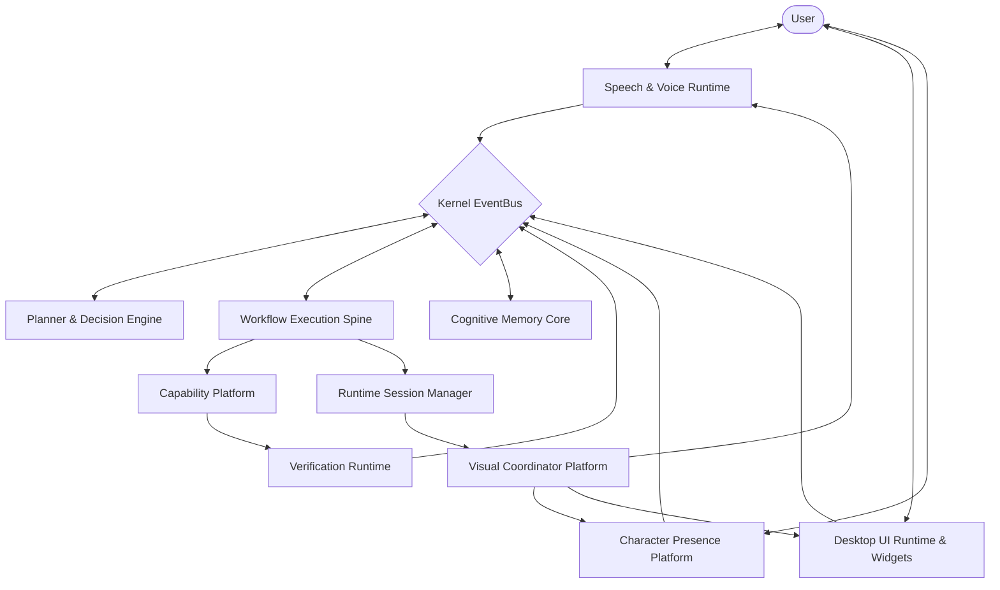

### Diagram 2: Boot Sequence
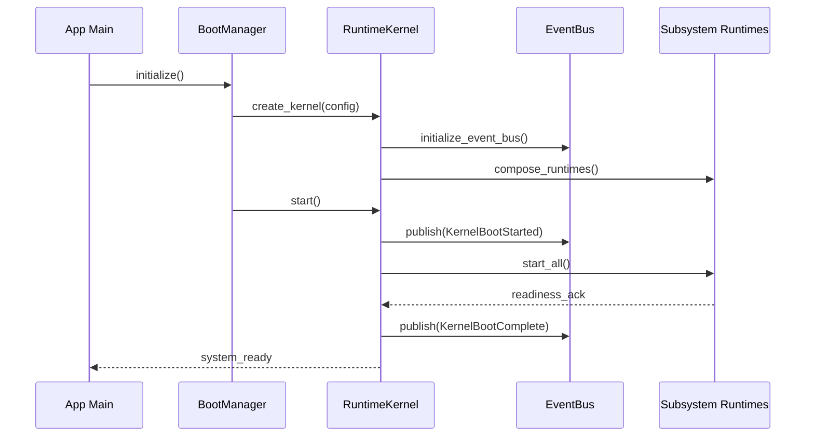

### Diagram 3: Kernel Startup
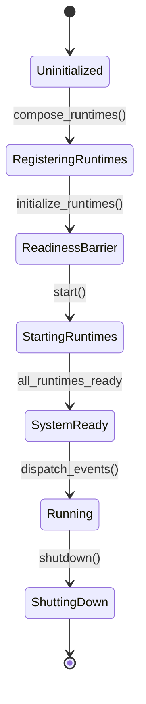

### Diagram 4: Layer Architecture
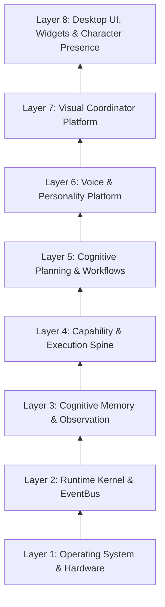

### Diagram 5: Module Dependency Graph
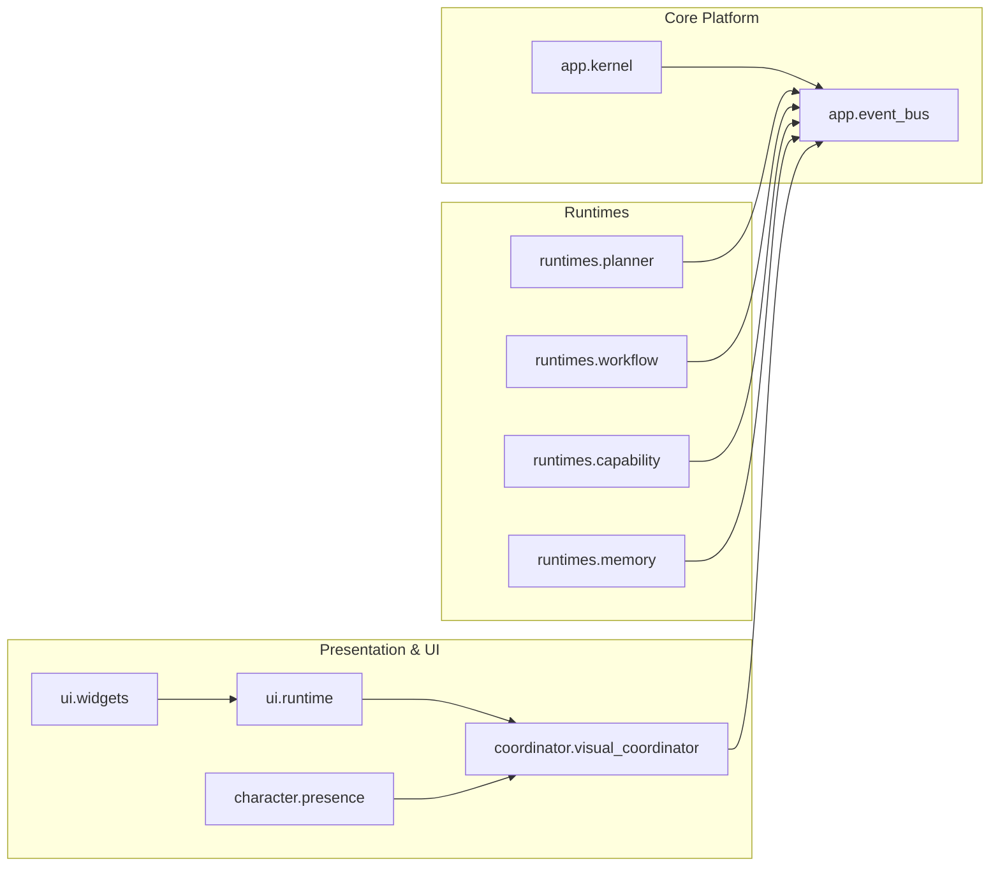

### Diagram 6: Runtime Dependency Graph
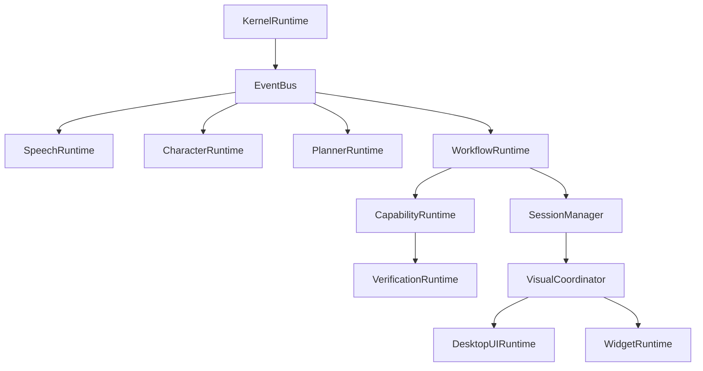

### Diagram 7: Capability Flow
```mermaid
graph LR
    WorkflowStep[Workflow Step] --> Invocation[Capability Request]
    Invocation --> Registry[Capability Registry]
    Registry --> Execute[Execute Capability]
    Execute --> Adaptor[Environment Adapter]
    Adaptor --> Output[CanonicalCapabilityOutput]
    Output --> Verifier[Verification Runtime]
    Verifier --> Result[ExecutionResult]
```

### Diagram 8: User Request Pipeline
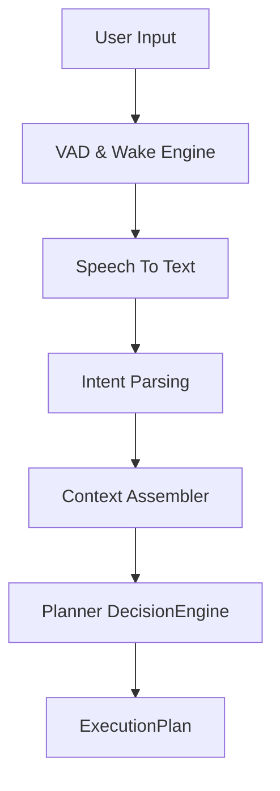

### Diagram 9: Voice Pipeline
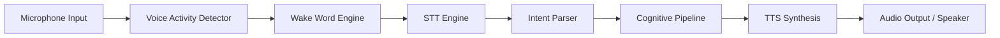

### Diagram 10: Speech Timeline
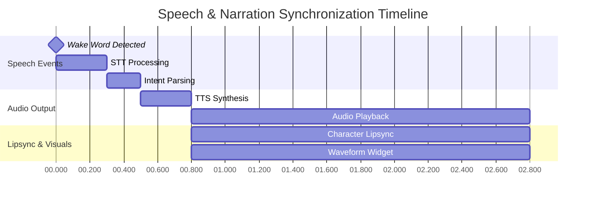

### Diagram 11: Planner Pipeline
```mermaid
graph TD
    Req[User Request] --> Context[Assemble Planning Context]
    Context --> Policy[Reasoning Policy Check]
    Policy --> Engine[DecisionEngine (Rule 18 Pure)]
    Engine --> Graph[Task Graph Generator]
    Graph --> Validation[Plan Schema Validator]
    Validation --> Output[Immutable ExecutionPlan]
```

### Diagram 12: Execution Pipeline
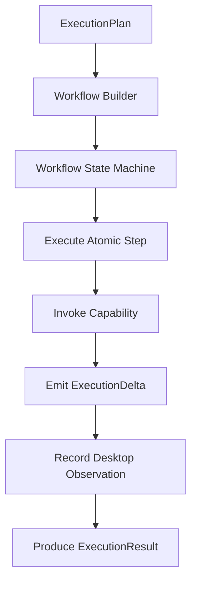

### Diagram 13: Verification Pipeline
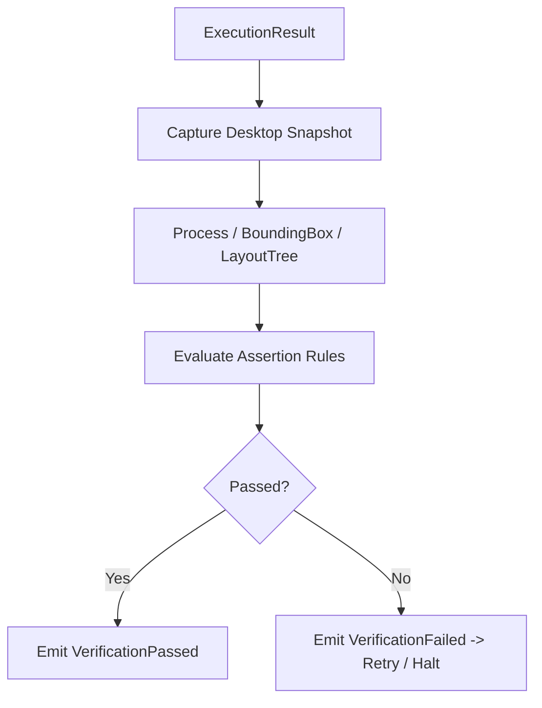

### Diagram 14: Analytics Pipeline
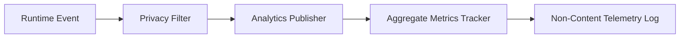

### Diagram 15: Character Runtime Architecture
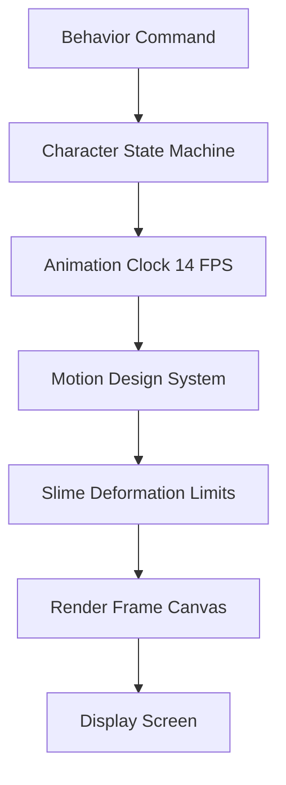

### Diagram 16: Behavior Scheduler
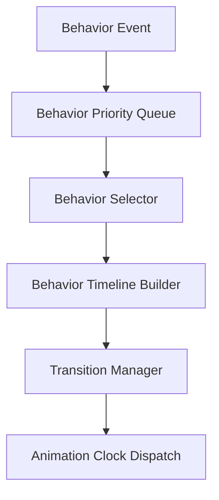

### Diagram 17: Motion System Physics
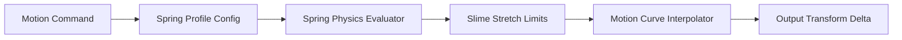

### Diagram 18: Presence Controller State Machine
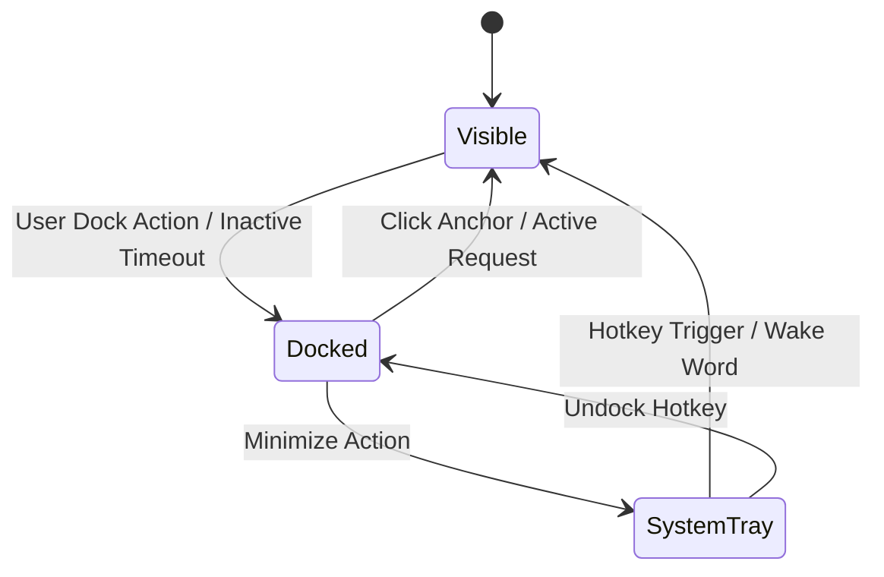

### Diagram 19: Desktop UI Runtime Foundation
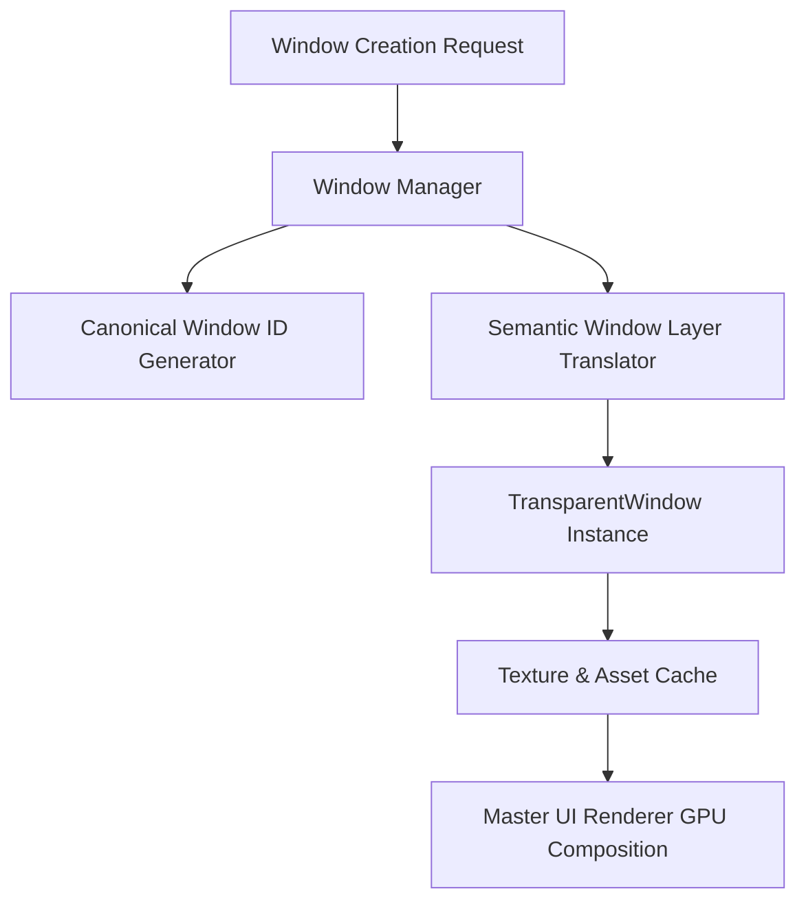

### Diagram 20: Widget Framework Architecture
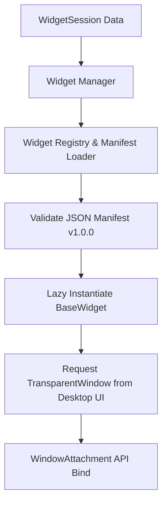

### Diagram 21: Visual Coordinator Architecture
```mermaid
graph TD
    Runtimes[Runtimes & Sessions] --> Unified[Timeline Scheduler]
    Unified --> Priority[Priority Engine]
    Priority --> Resolver[Conflict Resolver]
    Resolver --> Policy[Policy Engine]
    Policy --> Manager[Visual State Manager]
    Manager --> Sync[Broadcast Synchronized State]
```

### Diagram 22: Presentation Runtime Architecture
```mermaid
graph TD
    Deck[Presentation Deck] --> Session[Presentation Session]
    Session --> Narration[Narration Engine]
    Session --> Pointer[Laser Pointer Tracker]
    Session --> Slides[Slide Renderer]
    Narration --> Coordinator[Visual Coordinator Synchronization]
    Slides --> Coordinator
```

### Diagram 23: Runtime Session Lifecycle
```mermaid
stateDiagram-v2
    [*] --> Started
    Started --> Active: bind_session()
    Active --> Updated: update_data()
    Active --> Paused: user_pause()
    Paused --> Active: resume()
    Active --> Completed: session_finished
    Active --> Cancelled: user_cancel / error
    Completed --> [*]
    Cancelled --> [*]
```

### Diagram 24: Memory Data Flow
```mermaid
graph TD
    Obs[Desktop Observation] --> Session[Activity Session]
    Session --> Event[Activity Event]
    Event --> Episode[Memory Episode]
    Episode --> DB[(SQLite chitti_memory.db)]
    DB --> Index[BM25 & Vector Indexer]
    Index --> Retrieval[Universal Memory Retrieval]
```

### Diagram 25: Context Flow
```mermaid
graph TD
    Lang[Language Context] --> Assembler[Context Assembler]
    Obs[Desktop Activity Context] --> Assembler
    Mem[Memory Retrieval Context] --> Assembler
    Task[Task Execution Context] --> Assembler
    Assembler --> Projection[Read-Only PlanningContext]
    Projection --> Planner[Planner DecisionEngine]
```

### Diagram 26: Deterministic EventBus Architecture
```mermaid
graph TD
    Publisher[Publisher Subsystem] --> Event[Publish Event]
    Event --> Queue[Deterministic Event Queue]
    Queue --> Filter[Event Filter & Invariant Inspector]
    Filter --> Registry[Subscriber Registry]
    Registry --> Handler1[Subscriber Handler 1]
    Registry --> Handler2[Subscriber Handler 2]
```

### Diagram 27: Logging & Audit Pipeline
```mermaid
graph LR
    Subsystem[Subsystem Activity] --> Logger[Structural Logger]
    Logger --> Filter[Content Privacy Filter]
    Filter --> Formatter[JSON / Markdown Formatter]
    Formatter --> Storage[(Audit Log Storage)]
```

### Diagram 28: Configuration Flow
```mermaid
graph TD
    Config[Configuration Files / Env] --> Loader[Config Loader]
    Loader --> Profile[Hardware & Model Profiler]
    Profile --> Options[RuntimeConfiguration]
    Options --> Boot[BootManager Startup]
```

### Diagram 29: Plugin Architecture
```mermaid
graph TD
    Plugin[External Plugin Package] --> Manifest[Plugin Manifest]
    Manifest --> Loader[Plugin Loader]
    Loader --> Contract[Platform Capability Interface]
    Contract --> Registry[Capability / Widget Registry]
    Registry --> Coordinator[Visual Coordinator Hooks]
```

### Diagram 30: Complete End-to-End Request Trajectory
```mermaid
sequenceDiagram
    actor User
    participant Speech as Speech Runtime
    participant Planner as Planner Engine
    participant Workflow as Workflow Spine
    participant Cap as Capability Platform
    participant Verifier as Verification Runtime
    participant Sess as Session Manager
    participant Coord as Visual Coordinator
    participant Voice as Voice & TTS
    participant Char as Character Runtime
    participant UI as Desktop UI & Widgets

    User->>Speech: "Play Mamachi on YouTube" (Audio)
    Speech->>Speech: STT & Intent Parsing
    Speech->>Planner: Dispatch UserIntent
    Planner->>Planner: Evaluate DecisionEngine -> ExecutionPlan
    Planner->>Workflow: Execute Plan
    Workflow->>Cap: Invoke BrowserCapability(YouTube)
    Cap->>Cap: Open Browser Session
    Cap->>Verifier: Return ExecutionResult
    Verifier->>Verifier: Verify BoundingBox & BROWSER_READY
    Verifier->>Sess: Open Media WidgetSession
    Sess->>Coord: Notify Session Started
    Coord->>Voice: Schedule Speech Timeline ("Playing Mamachi boss.")
    Coord->>Char: Schedule Character Animation (Music Idle)
    Coord->>UI: Position Media Widget at Character Anchor
    Voice->>User: Speak Narration + Lipsync
    Char->>User: Animate Slime Mascot (14 FPS)
    UI->>User: Render Media Widget (30 FPS)
```

---

======================================================================
## 5. COMPLETE END-TO-END EXECUTION TRAJECTORY
======================================================================

### Sequence Step-by-Step Breakdown:

1. **Wake Word & Audio Capture:** Audio stream enters `SpeechRuntime`. `VoiceActivityDetector` detects speech boundary; `WakeEngine` validates wake activation.
2. **Speech-to-Text (STT):** Audio buffer is transcribed into canonical string input.
3. **Intent Parsing & Entity Extraction:** Input string parsed into typed `UserIntent` with resolved entities (`SearchQuery="Mamachi"`, `TargetApp="YouTube"`).
4. **Context Assembly:** `ContextAssembler` Projects desktop state, memory history, and conversation state into a read-only `PlanningContext`.
5. **Planner & Decision Engine:** `DecisionEngine` evaluates `PlanningContext` deterministically and generates an immutable `ExecutionPlan`.
6. **Workflow Building:** `WorkflowRuntime` instantiates an atomic workflow state machine.
7. **Capability Execution:** Workflow invokes `BrowserCapability`. `BrowserCapability` executes automation via Playwright adapter to open YouTube and search target media.
8. **Observation & Verification:** `VerificationRuntime` captures desktop layout tree and asserts `BROWSER_READY` condition.
9. **Runtime Session Binding:** `SessionManager` initializes a `Media` `WidgetSession` containing track title, playback state, and provider metadata.
10. **Visual Coordination:** `VisualCoordinator` receives session events, generates a `UnifiedTimeline`, resolves anchor priorities via `PriorityEngine`, and transitions canonical visual state to `SPEAKING` / `WORKING`.
11. **Voice Synthesis (TTS):** `TTSRuntime` synthesizes speech response ("Playing Mamachi boss"), generates speech timeline and lipsync markers.
12. **Character Animation:** `CharacterRuntime` transitions slime mascot animation to `Music Idle` at 14 FPS, governed by `MotionDesignSystem` spring deformation limits.
13. **Desktop UI & Widget Display:** `DesktopUIRuntime` requests a generic transparent window container, binds `Media` widget, applies `SemanticWindowLayer.CHARACTER_WIDGET` Z-order, and renders widget UI at 30 FPS.
14. **Telemetry & Audit Logging:** `AnalyticsPublisher` logs session duration and performance metrics; `StructuralLogger` appends audit trace.
15. **Memory Update:** Interaction episode appended to `chitti_memory.db` episodic storage.
16. **Return to Idle:** Upon session completion, visual state smoothly transitions to `IDLE` state.

---

======================================================================
## 6. PLATFORM CERTIFICATION & FREEZE MATRIX
======================================================================

| Platform Subsystem | Implementation Package | Status | Freeze Certificate |
| :--- | :--- | :--- | :--- |
| **Cognitive Core V1** | `desktop/app/kernel/` | COMPLETE | FROZEN |
| **Planner & Workflow Spine** | `desktop/runtimes/` | COMPLETE | FROZEN |
| **Cognitive Memory Core** | `desktop/memory/` | COMPLETE | FROZEN |
| **Character Platform** | `desktop/character/` | COMPLETE | PERMANENTLY FROZEN |
| **Motion Design System** | `desktop/shared/motion/` | COMPLETE | PERMANENTLY FROZEN |
| **Character Identity Platform**| `desktop/character/identity/` | COMPLETE | PERMANENTLY FROZEN |
| **Desktop UI Runtime Foundation**| `desktop/ui/runtime/`, `desktop/ui/window/` | COMPLETE | PERMANENTLY FROZEN |
| **Desktop Widget Framework** | `desktop/ui/widgets/` | COMPLETE | CERTIFIED & APPROVED |
| **Visual Coordinator Platform**| `desktop/coordinator/` | COMPLETE | VERIFIED & CERTIFIED |

======================================================================
## 7. DOCUMENTATION VERIFICATION CERTIFICATE
======================================================================

```
######################################################################
          CHITTI V2 MASTER ARCHITECTURE SPECIFICATION

                        STATUS:
                   CANONICAL & COMPLETE
######################################################################
```

This document represents the permanent, complete, and un-truncated architectural engineering specification for CHITTI V2.
