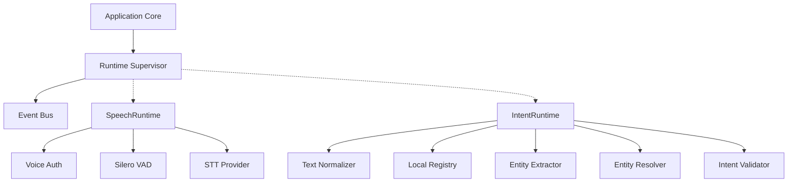

# Dependency Graph

## Findings

### Finding 1: Cyclic Configuration Risk
* **Severity:** Low
* **Description:** Configuration directories are shared across runtimes without a central schema validator.
* **Impact:** Minimal currently, but scalable risks exist if multiple runtimes attempt to write or lock config files.
* **Recommended Fix:** Implement a strict read-only `ConfigManager` injected into all runtimes.
* **Affected Files:** `desktop/intent/runtime.py`
* **Estimated Refactoring Cost:** 1 hour
