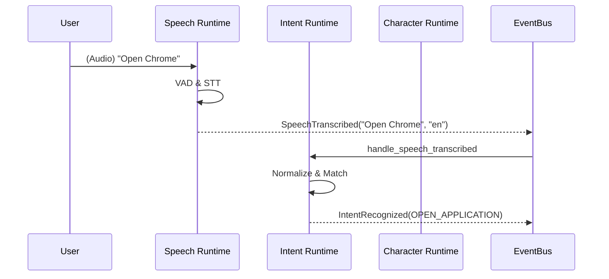

# Event Flow Report

## Overview
Analyzes the lifecycle of events moving through the EventBus across Phase 0-3 runtimes.

## Findings

### Finding 1: Unhandled Clarification Loops
* **Severity:** Medium
* **Description:** The Intent Runtime emits `IntentClarificationRequired`, but no existing Phase 3 logic handles this event.
* **Impact:** The system will drop medium-confidence intents silently until the Character/Workflow Runtimes are fully integrated.
* **Recommended Fix:** Ensure Phase 4 and Phase 7 specs explicitly subscribe to and handle `IntentClarificationRequired`.
* **Affected Files:** `desktop/intent/runtime.py`
* **Estimated Refactoring Cost:** N/A (Feature completion required).
