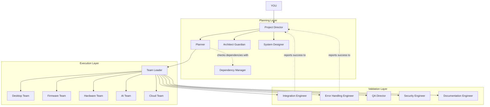

# CHITTI Companion Agent Hierarchy

The CHITTI project operates on a strict 4-layer organizational hierarchy to ensure robust planning, execution, and validation of all software and hardware components.

## Layer 1: Project Director
Acts as the bridge between the USER and the internal layers. Manages departments, not individual engineers. Receives final sign-off from the Validation layer and reports to the USER.

## Layer 2: Planning Layer
Before any code is written, this layer breaks down the roadmap.
* **Planner**: Acts as Scrum Master. Breaks epics into Task 001, 002.
* **Dependency Manager**: Checks prerequisites before a task can start.
* **Architect Guardian**: Protects the architecture, rejecting PRs that violate layer boundaries.
* **System Designer**: Creates diagrams (flow, sequence, state) before execution.

## Layer 3: Execution Layer
The builders of the system.
* **Team Leader**: Receives sequenced tasks from the Planner and distributes them to the specialized engineering teams.
* **Engineering Teams**: The 30 specialized agents (Desktop Lead, Voice Engineer, Servo Engineer, etc.) who write the actual code.

## Layer 4: Validation Layer
The gatekeepers. A feature is not "Done" until this layer signs off.
* **Integration Engineer**: Owns cross-module compatibility.
* **Error Handling Engineer**: Enforces recovery, logging, and safe modes.
* **QA / Security / Documentation**: Final checks before release.
