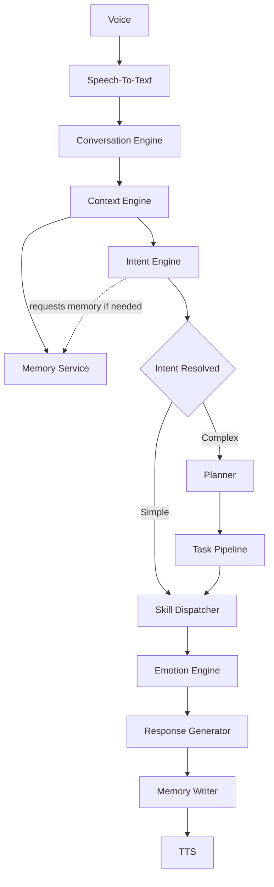

# Runtime Data Flow Architecture

The following diagram defines the critical path for a user request in the CHITTI system.

- Memory is an **on-demand service**, not a bottleneck.
- The Planner is bypassed for simple intents to maximize speed.
- The Skill Dispatcher triggers the appropriate action.

